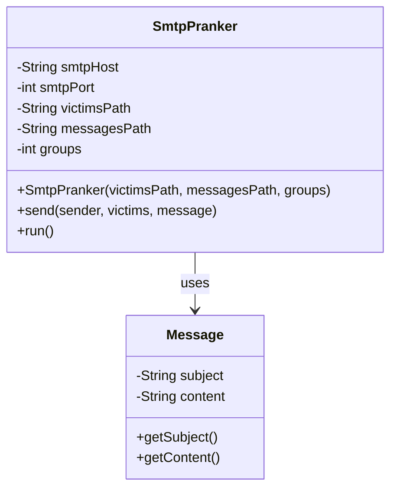

# SMTP Pranker

## Table of contents
- [SMTP Pranker](#smtp-pranker)
  - [Table of contents](#table-of-contents)
  - [Requirements](#requirements)
  - [Getting started](#getting-started)
    - [Clone the code](#clone-the-code)
    - [Deploy the code](#deploy-the-code)
    - [Setup your Environment file](#setup-your-environment-file)
    - [Execute demo](#execute-demo)
  - [Implementation Details](#implementation-details)
    - [Class Diagram](#class-diagram)
    - [Key Components](#key-components)
    - [SMTP Communication Example](#smtp-communication-example)
    - [Configuration Files](#configuration-files)
    - [Environment Configuration](#environment-configuration)
    - [Use Makefile](#use-makefile)
  - [References](#references)

## Requirements

* A Linux distribution or WSL
* Git
* Docker and Docker Compose
* Java 21
* Maven

## Getting started
This will bring up a demo instance

### Clone the code

```bash
git clone git@github.com:lei-rth/dai-lab-smtp.git && cd dai-lab-smtp
```

### Deploy the code

```bash
# Install "make" if not already installed
sudo apt-get install make 

# Copy default configuration
cp -n .env.example .env

# Start the stack 
make dev
```

Mock server is available at http://localhost:1080

### Setup your Environment file

Following variable setup in your [.env](.env) file will setup the demo environment for you

```ini
VICTIMS_LIST=victims.json
MESSAGES_LIST=messages.json
NUMBER_GROUPS=2
```

### Execute demo

```bash
make build run
```

## Implementation Details

### Class Diagram


### Key Components

1. **SmtpPranker Class**
   - Main class responsible for email pranking functionality
   - Manages SMTP connection and communication
   - Handles group creation and email distribution
   - Configurable through environment variables for SMTP settings

2. **Message Class**
   - Represents an email message with subject and content
   - Loaded from JSON configuration file

### SMTP Communication Example

Below is a typical SMTP dialogue between the client and server:

```
C: [Connection established]
S: 220 smtp.server.com Simple Mail Transfer Service Ready
C: HELO localhost
S: 250 Hello localhost
C: MAIL FROM: <sender@example.com>
S: 250 Ok
C: RCPT TO: <victim1@example.com>
S: 250 Ok
C: RCPT TO: <victim2@example.com>
S: 250 Ok
C: DATA
S: 354 Start mail input; end with <CRLF>.<CRLF>
C: Content-Type: text/html; charset=UTF-8
C: From: sender@example.com
C: To: victim1@example.com, victim2@example.com
C: Subject: Prank Email Subject
C: 
C: <html><body style="font-family: Arial, sans-serif;">
C: Email content goes here...
C: </body></html>
C: .
S: 250 Ok: queued as 12345
C: QUIT
S: 221 Bye
```

### Configuration Files

The application uses two main configuration files:

1. **victims.json**: Contains the list of email addresses to send pranks to
2. **messages.json**: Contains the collection of prank messages with subjects and content

The application randomly assigns victims into groups and sends them randomly selected prank messages.

### Environment Configuration

The SMTP connection can be configured through the `.env` file:
- `SMTP_HOST`: SMTP server hostname (default: localhost)
- `SMTP_PORT`: SMTP server port (default: 1025)

The number of groups can be configured through the `NUMBER_GROUPS` environment variable.

### Use Makefile

When developing, you can use [Makefile](https://en.wikipedia.org/wiki/Make_(software)) for doing the following operations :

| Name    | Description                         |
| ------- | ----------------------------------- |
| dev     | Create and start containers         |
| down    | Stop all containers services        |
| install | Install all maven dependencies      |
| build   | Compile the project as jar file     |
| run     | Run the project with .env variables |
| clean   | Clean directories for reset         |

## References
----------

* The [SMTP RFC](<https://tools.ietf.org/html/rfc5321#appendix-D>), and in particular the [example scenario](<https://tools.ietf.org/html/rfc5321#appendix-D>)
